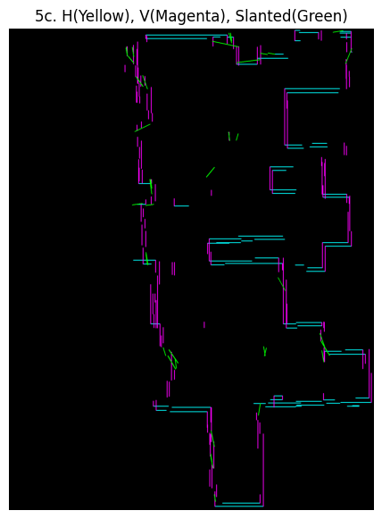
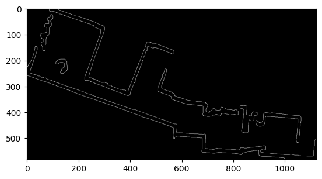

# SLAM-image-processor

## Introduction

This project processess maps generated by SLAM algorithms, typically as PGM and converts them into simplified, CAD-like line drawings. It aims to extract the main structural lines, representing walls as straight segments.

The script employs image processing techniques through OpenCV and includes steps for noise cleaning, line detection, line categorization (horizontal, vertical, slanted), merging of collinear orthogonal lines, and connection of orthogonal corners. It is designed to handle maps with both purely orthogonal and mixed orthogonal/slanted walls. Parameters are configurable via a `config.yaml` file.

## Features

*   Loads occupancy maps (PGM, JPG, PNG, etc.).
*   Binarizes the image to separate walls/obstacles from free/unknown space.
*   Cleans salt-and-pepper noise using contour filtering and morphological closing.
*   Detects line segments using the Probabilistic Hough Transform.
*   Categorizes detected lines into Horizontal, Vertical, and Slanted based on angle tolerance.
*   Snaps Horizontal/Vertical lines to be perfectly orthogonal.
*   Merges nearby collinear Horizontal/Vertical lines into longer segments.
*   Connects nearby endpoints of Horizontal and Vertical lines to form clean corners.
*   Filters slanted lines based on minimum length.
*   Outputs intermediate and final processed images.
*   Uses a `config.yaml` file for easy parameter tuning.

## Installation

1.  **Prerequisites:**
    *   Python 3.x installed.

2.  **Create a Virtual Environment (Recommended):**
    ```bash
    python -m venv venv
    # On Windows
    .\venv\Scripts\activate
    # On macOS/Linux
    source venv/bin/activate
    ```

3.  **Install Dependencies:**
    ```bash
    pip install opencv-python numpy pyyaml matplotlib
    ```

## Configuration

Parameters for the script are controlled via the `config.yaml` file. Before running, **you must edit `config.yaml`** to set the correct `image_path` for your input map file.

Key configuration sections:

*   `image_processing`: Defines input/output paths.
*   `binarization`: Controls how the image is converted to black and white.
*   `cleaning`: Parameters for noise removal and small gap filling.
*   `line_detection`: Settings for the Hough Transform line detector.
*   `line_categorization`: Tolerance for classifying lines as H/V or slanted.
*   `slanted_line_filtering`: Minimum length for keeping detected slanted lines.
*   `orthogonal_line_processing`: Parameters for merging and corner connection of H/V lines.
*   `output`: Controls aspects of the output image, like line thickness.

Refer to the comments within `config.yaml` for details on each parameter.

## Usage

1.  Ensure `config.yaml` is configured, especially the `image_path`.
2.  Place the input image file (e.g., `room1.jpg`) in the location specified by `image_path`.
3.  Run the script from the command line:
    ```bash
    python run.py
    ```
4.  The script will execute the processing pipeline, display plots of intermediate steps (like the cleaned image and final output), and save images to the directory specified by `output_dir` in the config file.

## Processing Steps

The `run.py` script executes the following pipeline:

1.  **Load Configuration:** Reads parameters from `config.yaml`.
2.  **Load & Binarize Image:** Loads the input image specified in the config, converts it to grayscale, and applies binary thresholding to create a black (background) and white (walls) image.
3.  **Clean Noise:** Applies contour area filtering to remove small, noisy detections and uses morphological closing to fill small gaps in walls.
4. **Edge detection**: Uses the OpenCV Canny to detect eddges to extract feautres like walls 
4.  **Detect Lines:** Uses the OpenCV Probabilistic Hough Transform (`HoughLinesP`) on the cleaned binary image to detect potential line segments.
5.  **Categorize & Snap Lines:** Iterates through detected raw lines:
    *   Calculates the angle and length.
    *   If the angle is within `angle_tolerance_degrees` of horizontal or vertical, the line is categorized as H or V, and its coordinates are "snapped" to be perfectly orthogonal (averaging the relevant coordinate). Length is stored.
    *   Otherwise, the line is categorized as Slanted. Original coordinates and length are stored.
6.  **Filter Slanted Lines:** Removes slanted lines shorter than `slanted_min_length` to reduce noise.
7.  **Merge Orthogonal Lines:** Merges collinear Horizontal lines that are close together (based on `merge_gap_pixels` and `merge_axis_tolerance`). Repeats the process independently for Vertical lines.
8.  **Connect Orthogonal Corners:** Finds endpoints of processed H and V lines that are within `corner_connection_threshold` distance of each other. Adjusts the coordinates of these endpoints so the lines meet precisely at the calculated intersection point, forming cleaner corners.
9.  **Combine & Draw Output:** Creates a final image by drawing the fully processed (merged and corner-connected) Horizontal and Vertical lines, along with the filtered Slanted lines, onto a blank canvas. Intermediate visualization steps are also plotted and saved.

## Results Showcase


| Room      | Input Image             | Cleaned Image                       | Canny Edges                         | Processed Lines (Colored)               | Final Output                    |
| :-------- | :---------------------- | :---------------------------------- | :---------------------------------- | :-------------------------------------- | :------------------------------ |
| **Room 1** |  |  |                              |  |  |
| **Room 2** |  |  | | ` |  |
| **Room 3** |  | |  |  |  |


## Further Improvements

*   **Parameter Tuning:** Experiment further with parameters in `config.yaml` (especially Hough, merging, and connection thresholds) for different map types to improve line continuity and reduce fragmentation or incorrect connections.
*   **Slanted Line Processing:** Implement merging for collinear slanted lines (grouping by angle and position) and corner connection logic for slanted-slanted and slanted-orthogonal intersections.
*   **Alignment:** Improve the snapping/connection logic to better handle cases where slanted and orthogonal walls should meet precisely. This might involve calculating exact intersection points.

Example: Slightly tuned version of snapping for room1

*   **Vector Output:** Modify the script to save the final lines in a vector format like SVG (Scalable Vector Graphics) or DXF (Drawing Exchange Format) for use in CAD software. This would involve using libraries capable of writing these formats (e.g., `svgwrite`, `ezdxf`).


## License

This project is licensed under the MIT License - see the LICENSE file for details


## References :
- https://stackoverflow.com/questions/20429052/opencv-convert-floorplan-image-into-data-model
- https://stackoverflow.com/questions/41002267/opencv-snap-corner-to-grid/70890822#70890822
